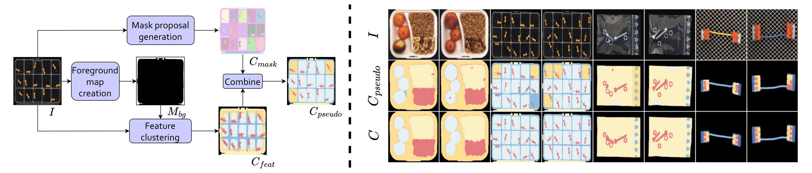
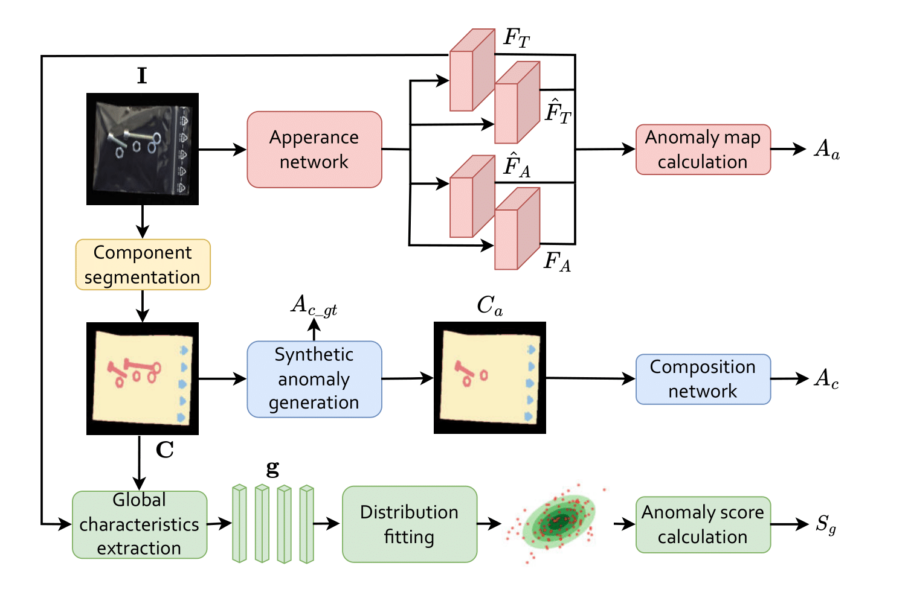

<div align="center">
<h1 align="center">[ICCV 2025] SALAD</h1>
<h3>Semantics-Aware Logical Anomaly Detection</h3>

[Matic Fučka](https://scholar.google.com/citations?user=2kdcuAkAAAAJ), [Vitjan Zavrtanik](https://scholar.google.com/citations?user=GO-UpVgAAAAJ), [Danijel Skočaj](https://scholar.google.com/citations?user=sZpqYzAAAAAJ)

University of Ljubljana, Faculty of Computer and Information Science

[](https://arxiv.org/abs/2509.02101)

[**Overview**](#overview) | [**Get Started**](#get-started) | [**Results**](#pretrained-weights-and-results) | [**Reference**](#reference) | [**Questions**](#questions)

</div>

## Overview

This repository contains official PyTorch implementation for **SALAD - Semantics-Aware Logical Anomaly Detection** (Accepted to ICCV 2025).

SALAD (Semantics-Aware Logical Anomaly Detection) extends surface anomaly detection to capture both structural (scratches, dents) and logical (missing/misplaced parts) anomalies. First, we introduce a novel composition map generation process, that enables direct extraction of composition maps from the image without the need for hand labels or category-specific procedures. 

<p align="center">
    
</p>


Second, it introduces a compositional branch that learns the normality distribution of object composition maps. SALAD sets a new state-of-the-art on MVTec LOCO (96.1% AUROC).

<p align="center">
    
</p>

## Get Started

### Environment setup

Create a Python environment and install required packages:

```bash
conda create -n SALAD python=3.10 pip
conda activate SALAD
pip install torch torchvision --index-url https://download.pytorch.org/whl/cu121
pip install opencv-python
pip install segment-anything
pip install segment-anything-hq
pip install scikit-learn
pip install timm
pip install positional-encodings[pytorch]
pip install imgaug
pip install numpy==1.26
pip install pandas
```

###

Download MVTec LOCO from this [link](https://www.mvtec.com/company/research/datasets/mvtec-loco/downloads) or via the supplemented script:

```bash
./download_loco.sh
```

### Composition map generation

Already generated composition maps can be downloaded via the following script:
```bash
./download_composition_maps.sh
```

In the case you wish to generate your own composition maps first generate background masks with SAM (download the pretrained weights using the script `download_sam.sh`) run:
```bash
python python create_fg_masks.py
```

Then create the pseudo labels with:
```bash
python python create_pseudo_labels.py --category <category_name>
```

In the end train a composition map segmentation model with:
```bash
python train_composition_segmentation_model.py --category <category_name>
```

### Training and evaluation

Run the training and evaluation with:
```bash
python train_salad.py --category <category_name>
```
NOTE: ImageNet has to be downloaded to enable training of EfficientAD.

Run evaluation only:
```bash
python test_salad.py --category <category_name>
```

## Pretrained weights and results

Download the pretrained weights using the following script:
```bash
./download_pretrained_weights.sh
```
and evaluate it with the evaluation command above.

<p align="center">
    
</p>


## Reference

If you found this work useful, consider citing our paper and giving this repo a ⭐ 😃
```bibtex
@InProceedings{fucka_salad,
  title={{SALAD} -- {S}emantics-{A}ware {L}ogical {A}nomaly {D}etection},
  author={Fu{\v{c}}ka, Matic and Zavrtanik, Vitjan and Sko{\v{c}}aj, Danijel},
  booktitle={Proceedings of the IEEE/CVF International Conference on Computer Vision (ICCV)},
  year={2025},
  month={October}
}
```
## Questions

For issues or questions, please open a GitHub [issue](https://github.com/MaticFuc/SALAD/issues) or email the author directly.

## Acknowledgement

Thanks to [ComAD](https://github.com/liutongkun/comad) and [EfficientAD](https://github.com/nelson1425/EfficientAD) for inspiration.
